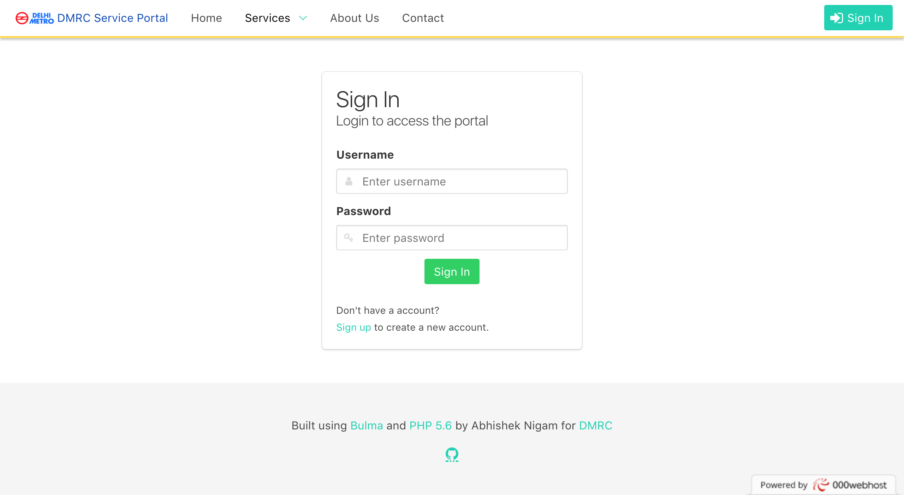
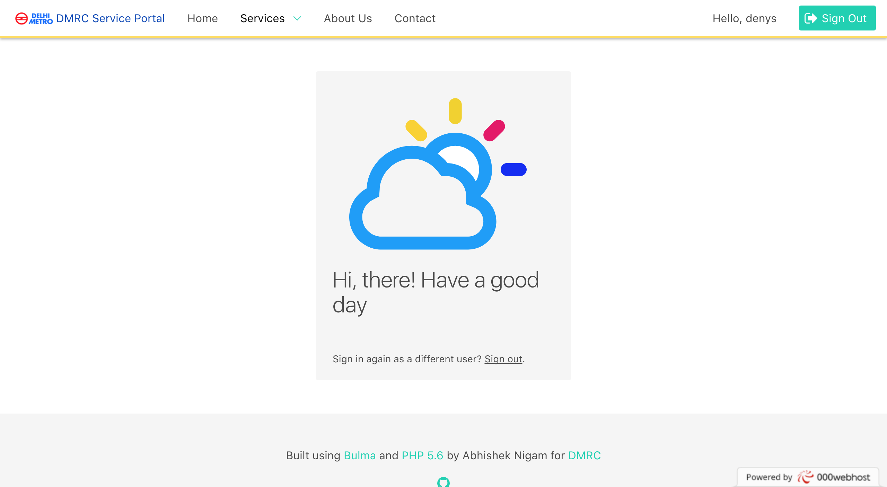
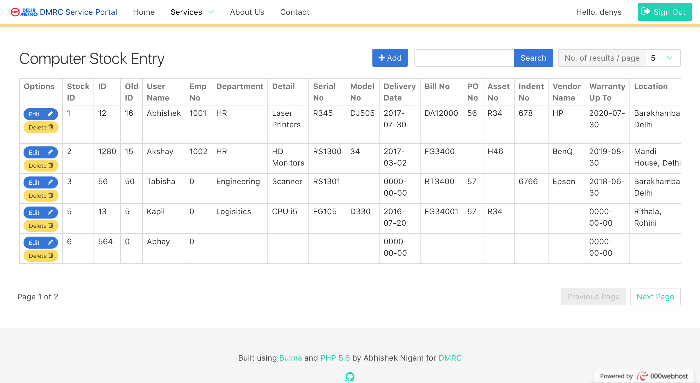
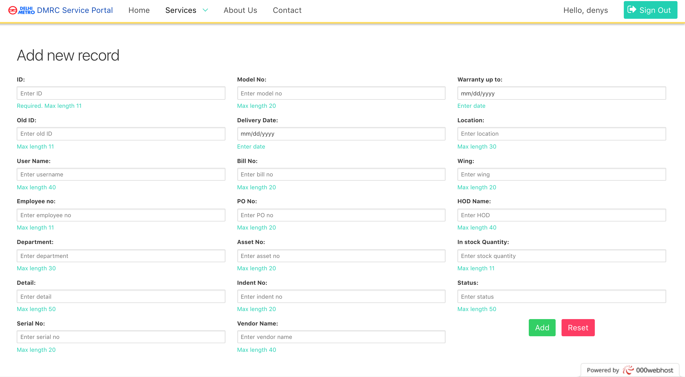
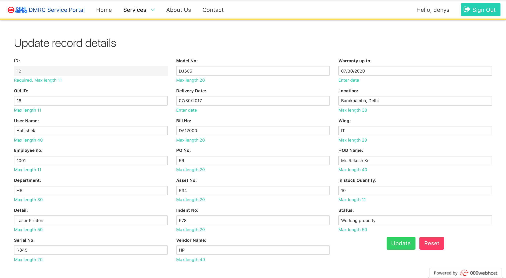

# Inventory Management System
This website is a system for managing stock inventories. Specifically its made for CRUD functionalites on two tables according to use case, but can be easily extended to manage other tables in a database.
 
 
Check out the website [here.](http://dmrc-inventory.000webhostapp.com)
 
Developed for [Delhi Metro Rail Corporation (DMRC)](http://www.delhimetrorail.com)

### Dependencies
This project uses the following :

- [PHP 5.6](http://php.net/) 
- [Bulma CSS Framework v0.4.4](http://bulma.io/) 
- [Font Awesome Icons](http://fontawesome.io/) 

It also uses these widgets : 

- [jQuery Date Picker](http://jqueryui.com/datepicker/) 
- [jQuery Time Picker](http://trentrichardson.com/examples/timepicker/) 

And their dependencies : 

- [jQuery](http://jquery.com/) 
- [jQuery UI](http://jqueryui.com/) 

This project was developed and tested using XAMPP for Windows

### Database Schema
Check for schemas directory for table schema images, and sql file to create the associated database.

### How to run:

- Make the tables in db according to the specified schema 
- Change database credentials in src/inc.connect.php like user, host, password, etc

### Development
Want to contribute? Great! Fork me!

#### Screenshots 

### License
MIT

### Say Hi
[Email: abhisheknigam1996@gmail.com](mailto://abhisheknigam1996@gmail.com) 
[LinkedIn](https://www.linkedin.com/in/abhishek-nigam25)

*last uplated: 31 July 2017*
